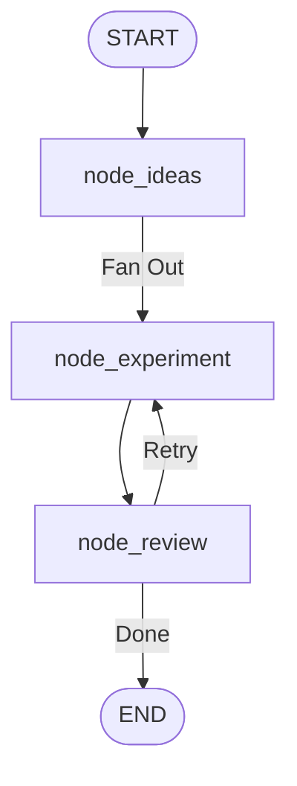
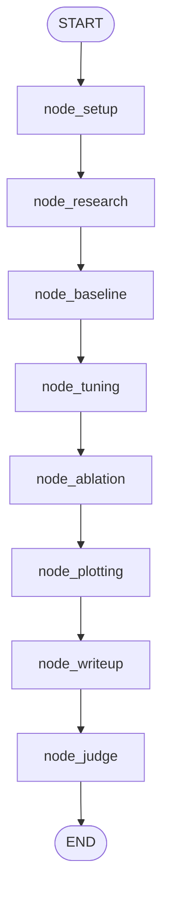
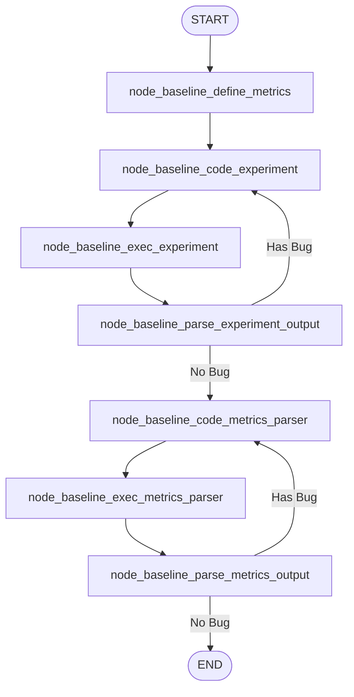
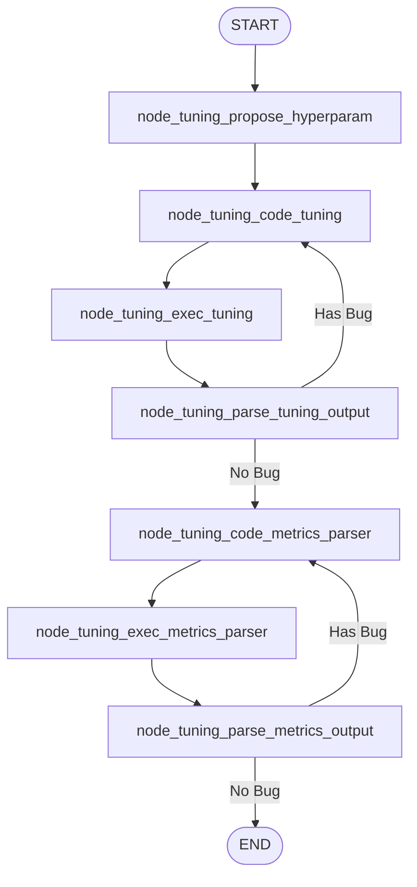
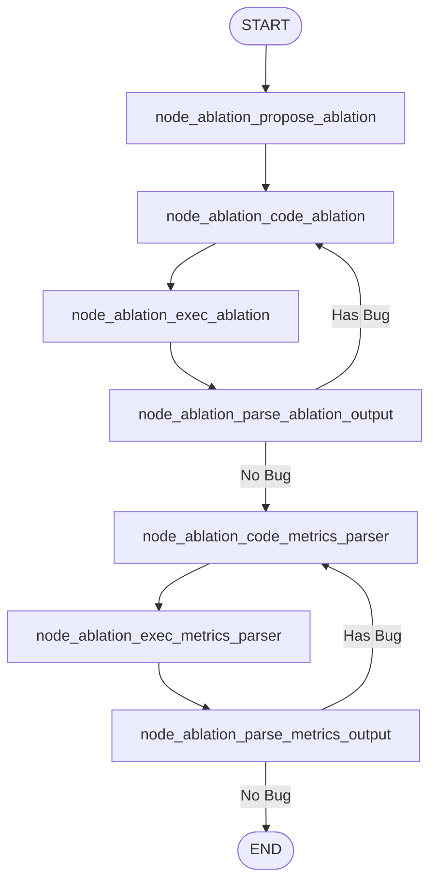
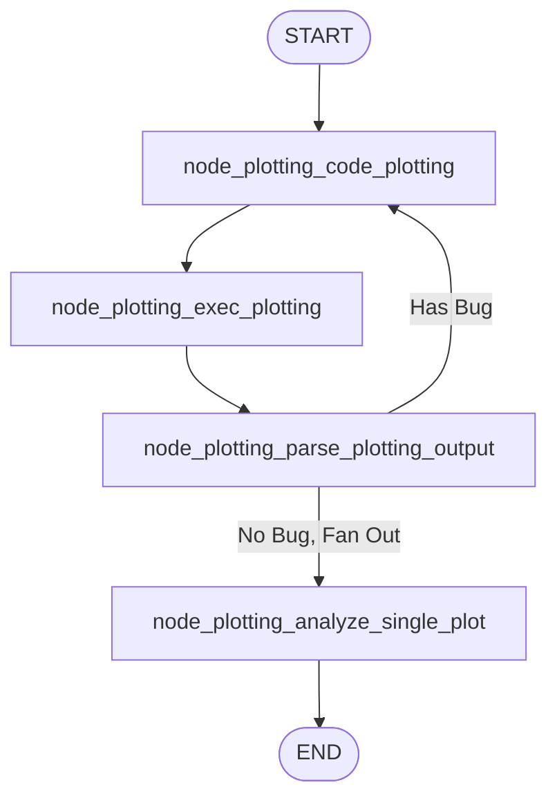
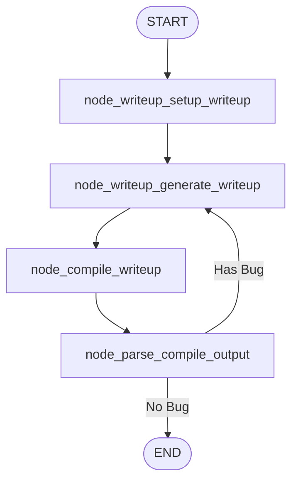

# aigraph

Graph implementation based on [Sakana][1]

## About

Scientific research automation using LangGraph agents.

## Development

### Requirements

- **pdflatex**: Required for LaTeX document compilation

```bash
sudo apt-get install texlive
# or
brew install basictex
```

### Setup

```bash
uv sync
```

### LangGraph Core Concepts

- **Context**: Passes runtime dependencies (database connections)
- **State**: Holds graph data relevant to execution
- **Config**: Configures LangChain/LangGraph (e.g., `thread_id`)
- **Checkpointer**: Persists state at each super-step

**Use Cases**:
- Human-in-the-loop: Pause for intervention at nodes
- Memory: Retain conversation history across sessions
- Time travel: Revert to previous execution states
- Fault tolerance: Resume from last checkpoint

**Example**:

```python
from langgraph.graph import StateGraph
from langgraph.checkpoint.memory import MemorySaver

# Define state
class State(TypedDict):
    messages: list[str]

# Node with context access
def process(state: State, context):
    db = context["db"]  # Access runtime dependency
    # Use db connection here
    return {"messages": state["messages"] + ["done"]}

# Build graph
graph = StateGraph(State)
graph.add_node("process", process)
graph.set_entry_point("process")
graph.set_finish_point("process")

# Compile with checkpointer
app = graph.compile(checkpointer=MemorySaver())

# Invoke with config and context
result = app.invoke(
    {"messages": ["start"]},
    config={"configurable": {"thread_id": "1"}},
    context={"db": db_connection}
)
```

## Running Scripts

Execute individual agents:

- `uv run -m aigraph.scripts.run_baseline` - Define metrics, run baseline
- `uv run -m aigraph.scripts.run_tuning` - Hyperparameter optimization
- `uv run -m aigraph.scripts.run_ablation` - Ablation studies
- `uv run -m aigraph.scripts.run_plotting` - Generate plots and analysis
- `uv run -m aigraph.scripts.run_writeup` - Generate LaTeX document
- `uv run -m aigraph.scripts.run_pipeline` - Execute complete pipeline

## Complete Pipeline (run_pipeline)

Main orchestrator with parallel experiments and review loop:



### Experiment Sub-Graph

Sequential stages within each experiment:



## Agent Architectures

### 1. Baseline Agent

Defines metrics and runs baseline experiment.



### 2. Tuning Agent

Proposes and tests hyperparameters.



### 3. Ablation Agent

Proposes and runs ablation studies.



### 4. Plotting Agent

Generates and analyzes visualization plots.



### 5. Writeup Agent

Generates and compiles LaTeX document.



[1]: https://github.com/SakanaAI/AI-Scientist